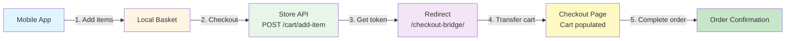

# 🛒 WooCommerce Cart API Integration Guide
## HSS Website Team Implementation Guide

---

## 📋 Table of Contents

- [Overview](#overview)
- [Architecture & Flow](#architecture--flow)
- [Engineering Tasks](#engineering-tasks)
- [WooCommerce Store API Reference](#woocommerce-store-api-reference)
- [Implementation Details](#implementation-details)
- [Security Considerations](#security-considerations)
- [Error Handling](#error-handling)
- [Testing Checklist](#testing-checklist)
- [Troubleshooting](#troubleshooting)

---

## 🎯 Overview

This document outlines the integration requirements for the HSS Website team to support the mobile app's cart functionality using the **WooCommerce Store API**. The app will add items to the cart via the Store API, and users will be redirected to the website's checkout page to complete their order and payment.

### Key Requirements

- ✅ **No in-app payments** - All payments must be processed on the website
- ✅ **Seamless cart transfer** - Cart items added in-app must appear on the website checkout page (items will be visible in the cart section of the checkout page)
- ✅ **Cart token authentication** - Use WooCommerce Store API cart tokens for session management
- ✅ **Checkout bridge** - Custom endpoint to transfer Store API cart to web session

---

## 🏗️ Architecture & Flow

### User Journey



### Technology Stack

- **WooCommerce Store API**: Public REST API for cart operations
- **Cart Tokens**: Header-based authentication for cart sessions
- **WordPress/WooCommerce**: Standard checkout page integration
- **PHP**: Custom checkout bridge endpoint

---

## 🔧 Engineering Tasks

### Task 1: Implement Checkout Bridge Endpoint

**Priority**: 🔴 **CRITICAL**

Create a custom WordPress endpoint that:
- Accepts `cart_token` as a query parameter
- Retrieves cart contents via Store API
- Transfers items to WooCommerce web session
- Redirects to standard checkout page

**Endpoint URL**: `/checkout-bridge/?cart_token={token}`

### Task 2: Store API Integration

**Priority**: 🔴 **CRITICAL**

Implement PHP functions to:
- Make authenticated requests to Store API
- Handle cart token in request headers
- Parse Store API cart response
- Map Store API items to WooCommerce cart items

### Task 3: Cart Transfer Logic

**Priority**: 🔴 **CRITICAL**

Build cart transfer functionality:
- Clear existing WooCommerce cart
- Add items from Store API cart
- Handle variable products and variations
- Preserve quantities and pricing

### Task 4: Error Handling & User Feedback

**Priority**: 🟡 **HIGH**

Implement error handling for:
- Missing or invalid cart tokens
- Expired cart sessions
- Failed cart transfers
- Non-purchasable products

### Task 5: Customer Data Transfer (Optional)

**Priority**: 🟢 **MEDIUM**

If billing/shipping data is available in Store API cart:
- Pre-populate checkout form fields
- Transfer customer information to WooCommerce session

### Task 6: Testing & Validation

**Priority**: 🟡 **HIGH**

- Unit tests for cart transfer functions
- Integration tests with Store API
- End-to-end checkout flow testing
- Error scenario testing

---

## 📚 WooCommerce Store API Reference

### Base URL

```
https://yourstore.com/wp-json/wc/store/v1
```

### Authentication

The Store API uses **cart tokens** passed in HTTP headers:

```http
Cart-Token: {cart_token_string}
```

**Important**: Cart tokens are returned in response headers and should be extracted and stored for subsequent requests.

### Key Endpoints

#### 1. Get Cart

**Endpoint**: `GET /cart`

**Headers**:
```http
Cart-Token: {cart_token}
Content-Type: application/json
```

**Response**:
```json
{
  "items": [
    {
      "key": "cart_item_key",
      "id": 123,
      "quantity": 2,
      "name": "Product Name",
      "prices": {
        "price": "10.00",
        "regular_price": "10.00",
        "sale_price": "0.00"
      }
    }
  ],
  "coupons": [],
  "fees": [],
  "totals": {
    "total_items": "20.00",
    "total_items_tax": "4.00",
    "total_fees": "0.00",
    "total_fees_tax": "0.00",
    "total_discount": "0.00",
    "total_discount_tax": "0.00",
    "total_shipping": "5.00",
    "total_shipping_tax": "1.00",
    "total_price": "30.00",
    "total_tax": "5.00",
    "currency_code": "GBP",
    "currency_symbol": "£"
  }
}
```

**Response Headers**:
```http
Cart-Token: {new_or_updated_token}
```

#### 2. Add Item to Cart

**Endpoint**: `POST /cart/add-item`

**Query Parameters**:
- `id` (required): Product or variation ID
- `quantity` (required): Number of items to add

**Headers**:
```http
Cart-Token: {cart_token}
Content-Type: application/json
```

**Example Request**:
```bash
curl -X POST \
  "https://yourstore.com/wp-json/wc/store/v1/cart/add-item?id=123&quantity=2" \
  -H "Cart-Token: abc123xyz" \
  -H "Content-Type: application/json"
```

**Response**: Same as Get Cart endpoint

#### 3. Update Cart Item

**Endpoint**: `POST /cart/update-item`

**Query Parameters**:
- `key` (required): Cart item key
- `quantity` (required): New quantity

#### 4. Remove Cart Item

**Endpoint**: `POST /cart/remove-item`

**Query Parameters**:
- `key` (required): Cart item key

### Cart Token Lifecycle

1. **Initial Request**: Make a `GET /cart` request without a token
2. **Token Generation**: WooCommerce returns a `Cart-Token` in response headers
3. **Subsequent Requests**: Include the token in all cart operations
4. **Token Refresh**: Tokens may be refreshed on each request (check response headers)
5. **Token Expiration**: Tokens expire after a period of inactivity (typically 24-48 hours)

---

## 💻 Implementation Details

### Step 1: Register Checkout Bridge Endpoint

Add to your theme's `functions.php` or a custom plugin:

```php
<?php
/**
 * Register custom checkout bridge endpoint
 */
function hss_register_checkout_bridge_endpoint() {
    add_rewrite_rule(
        '^checkout-bridge/?$',
        'index.php?checkout_bridge=1',
        'top'
    );
}
add_action('init', 'hss_register_checkout_bridge_endpoint');

/**
 * Add query var for checkout bridge
 */
function hss_add_checkout_bridge_query_var($vars) {
    $vars[] = 'checkout_bridge';
    return $vars;
}
add_filter('query_vars', 'hss_add_checkout_bridge_query_var');
```

### Step 2: Handle Checkout Bridge Requests

```php
/**
 * Handle checkout bridge requests
 */
function hss_handle_checkout_bridge() {
    global $wp_query;
    
    // Check if this is a checkout bridge request
    if (!isset($wp_query->query_vars['checkout_bridge'])) {
        return;
    }
    
    // Get cart token from query parameter
    $cart_token = isset($_GET['cart_token']) 
        ? sanitize_text_field($_GET['cart_token']) 
        : '';
    
    if (empty($cart_token)) {
        // No cart token provided, redirect to checkout with error
        wp_redirect(add_query_arg(
            'cart_error', 
            'missing_token', 
            wc_get_checkout_url()
        ));
        exit;
    }
    
    // Retrieve cart contents via Store API
    $cart_data = hss_get_cart_via_store_api($cart_token);
    
    if (is_wp_error($cart_data) || empty($cart_data['items'])) {
        // Failed to retrieve cart or cart is empty
        wp_redirect(add_query_arg(
            'cart_error', 
            'invalid_cart', 
            wc_get_checkout_url()
        ));
        exit;
    }
    
    // Clear existing WooCommerce cart
    WC()->cart->empty_cart();
    
    // Transfer items from Store API cart to WooCommerce web session
    $transfer_success = hss_transfer_cart_items_to_woocommerce($cart_data['items']);
    
    if (!$transfer_success) {
        // Failed to transfer items
        wp_redirect(add_query_arg(
            'cart_error', 
            'transfer_failed', 
            wc_get_checkout_url()
        ));
        exit;
    }
    
    // Optionally transfer customer data if available
    if (isset($cart_data['billing_address']) || isset($cart_data['shipping_address'])) {
        hss_transfer_customer_data($cart_data);
    }
    
    // Redirect to standard checkout page
    wp_redirect(wc_get_checkout_url());
    exit;
}
add_action('template_redirect', 'hss_handle_checkout_bridge');
```

### Step 3: Retrieve Cart via Store API

```php
/**
 * Retrieve cart contents via WooCommerce Store API
 * 
 * @param string $cart_token The Store API cart token
 * @return array|WP_Error Cart data or error
 */
function hss_get_cart_via_store_api($cart_token) {
    $store_api_url = home_url('/wp-json/wc/store/v1/cart');
    
    $response = wp_remote_get($store_api_url, array(
        'headers' => array(
            'Cart-Token' => $cart_token,
            'Content-Type' => 'application/json',
        ),
        'timeout' => 10,
        'sslverify' => true, // Use false only for local development
    ));
    
    if (is_wp_error($response)) {
        error_log('HSS Cart Bridge: Store API request failed - ' . $response->get_error_message());
        return $response;
    }
    
    $response_code = wp_remote_retrieve_response_code($response);
    
    if ($response_code !== 200) {
        $response_body = wp_remote_retrieve_body($response);
        error_log(sprintf(
            'HSS Cart Bridge: Store API returned error code %d - %s',
            $response_code,
            $response_body
        ));
        
        return new WP_Error(
            'store_api_error',
            sprintf('Store API returned error code: %d', $response_code),
            array('status' => $response_code)
        );
    }
    
    $body = wp_remote_retrieve_body($response);
    $cart_data = json_decode($body, true);
    
    if (json_last_error() !== JSON_ERROR_NONE) {
        error_log('HSS Cart Bridge: Failed to parse Store API response - ' . json_last_error_msg());
        
        return new WP_Error(
            'json_error',
            'Failed to parse Store API response',
            array('error' => json_last_error_msg())
        );
    }
    
    return $cart_data;
}
```

### Step 4: Transfer Cart Items to WooCommerce Session

```php
/**
 * Transfer cart items from Store API format to WooCommerce web session
 * 
 * @param array $store_api_items Items from Store API cart response
 * @return bool Success status
 */
function hss_transfer_cart_items_to_woocommerce($store_api_items) {
    if (empty($store_api_items) || !is_array($store_api_items)) {
        return false;
    }
    
    $success_count = 0;
    
    foreach ($store_api_items as $item) {
        // Extract product ID and quantity from Store API item
        $product_id = isset($item['id']) ? intval($item['id']) : 0;
        $quantity = isset($item['quantity']) ? intval($item['quantity']) : 1;
        
        if ($product_id <= 0) {
            continue;
        }
        
        // Check if product exists and is purchasable
        $product = wc_get_product($product_id);
        
        if (!$product || !$product->is_purchasable()) {
            error_log(sprintf(
                'HSS Cart Bridge: Product %d is not purchasable or does not exist',
                $product_id
            ));
            continue;
        }
        
        // Handle variable products
        $variation_id = 0;
        $variation = array();
        
        if ($product->is_type('variable')) {
            // Extract variation ID if available
            $variation_id = isset($item['variation_id']) 
                ? intval($item['variation_id']) 
                : 0;
            
            if ($variation_id > 0) {
                // Extract variation attributes
                $variation_data = isset($item['variation']) && is_array($item['variation']) 
                    ? $item['variation'] 
                    : array();
                
                // Convert variation data format
                foreach ($variation_data as $attr) {
                    if (isset($attr['attribute']) && isset($attr['value'])) {
                        $variation[$attr['attribute']] = $attr['value'];
                    }
                }
            } else {
                // If no variation_id but product is variable, skip
                error_log(sprintf(
                    'HSS Cart Bridge: Variable product %d missing variation_id',
                    $product_id
                ));
                continue;
            }
        }
        
        // Add item to WooCommerce cart
        $cart_item_key = WC()->cart->add_to_cart(
            $product_id,
            $quantity,
            $variation_id,
            $variation
        );
        
        if ($cart_item_key) {
            $success_count++;
            
            // Optionally apply custom cart item data
            if (isset($item['meta_data']) && is_array($item['meta_data'])) {
                foreach ($item['meta_data'] as $meta) {
                    if (isset($meta['key']) && isset($meta['value'])) {
                        WC()->cart->cart_contents[$cart_item_key][$meta['key']] = $meta['value'];
                    }
                }
            }
        } else {
            error_log(sprintf(
                'HSS Cart Bridge: Failed to add product %d to cart',
                $product_id
            ));
        }
    }
    
    // Return true if at least one item was added successfully
    return $success_count > 0;
}
```

### Step 5: Transfer Customer Data (Optional)

```php
/**
 * Transfer customer data (billing/shipping addresses) if available
 * 
 * @param array $cart_data Full cart data from Store API
 */
function hss_transfer_customer_data($cart_data) {
    // Set billing address if available
    if (isset($cart_data['billing_address']) && is_array($cart_data['billing_address'])) {
        $billing = $cart_data['billing_address'];
        
        WC()->customer->set_billing_first_name(
            isset($billing['first_name']) ? sanitize_text_field($billing['first_name']) : ''
        );
        WC()->customer->set_billing_last_name(
            isset($billing['last_name']) ? sanitize_text_field($billing['last_name']) : ''
        );
        WC()->customer->set_billing_company(
            isset($billing['company']) ? sanitize_text_field($billing['company']) : ''
        );
        WC()->customer->set_billing_address_1(
            isset($billing['address_1']) ? sanitize_text_field($billing['address_1']) : ''
        );
        WC()->customer->set_billing_address_2(
            isset($billing['address_2']) ? sanitize_text_field($billing['address_2']) : ''
        );
        WC()->customer->set_billing_city(
            isset($billing['city']) ? sanitize_text_field($billing['city']) : ''
        );
        WC()->customer->set_billing_state(
            isset($billing['state']) ? sanitize_text_field($billing['state']) : ''
        );
        WC()->customer->set_billing_postcode(
            isset($billing['postcode']) ? sanitize_text_field($billing['postcode']) : ''
        );
        WC()->customer->set_billing_country(
            isset($billing['country']) ? sanitize_text_field($billing['country']) : ''
        );
        WC()->customer->set_billing_email(
            isset($billing['email']) ? sanitize_email($billing['email']) : ''
        );
        WC()->customer->set_billing_phone(
            isset($billing['phone']) ? sanitize_text_field($billing['phone']) : ''
        );
    }
    
    // Set shipping address if available
    if (isset($cart_data['shipping_address']) && is_array($cart_data['shipping_address'])) {
        $shipping = $cart_data['shipping_address'];
        
        WC()->customer->set_shipping_first_name(
            isset($shipping['first_name']) ? sanitize_text_field($shipping['first_name']) : ''
        );
        WC()->customer->set_shipping_last_name(
            isset($shipping['last_name']) ? sanitize_text_field($shipping['last_name']) : ''
        );
        WC()->customer->set_shipping_company(
            isset($shipping['company']) ? sanitize_text_field($shipping['company']) : ''
        );
        WC()->customer->set_shipping_address_1(
            isset($shipping['address_1']) ? sanitize_text_field($shipping['address_1']) : ''
        );
        WC()->customer->set_shipping_address_2(
            isset($shipping['address_2']) ? sanitize_text_field($shipping['address_2']) : ''
        );
        WC()->customer->set_shipping_city(
            isset($shipping['city']) ? sanitize_text_field($shipping['city']) : ''
        );
        WC()->customer->set_shipping_state(
            isset($shipping['state']) ? sanitize_text_field($shipping['state']) : ''
        );
        WC()->customer->set_shipping_postcode(
            isset($shipping['postcode']) ? sanitize_text_field($shipping['postcode']) : ''
        );
        WC()->customer->set_shipping_country(
            isset($shipping['country']) ? sanitize_text_field($shipping['country']) : ''
        );
    }
    
    // Save customer data
    WC()->customer->save();
}
```

### Step 6: Display Error Messages

```php
/**
 * Display error messages on checkout page if cart transfer failed
 */
function hss_display_cart_transfer_errors() {
    if (!is_checkout()) {
        return;
    }
    
    $error = isset($_GET['cart_error']) 
        ? sanitize_text_field($_GET['cart_error']) 
        : '';
    
    if (empty($error)) {
        return;
    }
    
    $messages = array(
        'missing_token' => __(
            'Cart token was not provided. Please try again from the app.',
            'hss'
        ),
        'invalid_cart' => __(
            'Unable to retrieve your cart. The cart may have expired or is invalid.',
            'hss'
        ),
        'transfer_failed' => __(
            'Failed to transfer cart items. Please try again.',
            'hss'
        ),
    );
    
    $message = isset($messages[$error]) 
        ? $messages[$error] 
        : __('An error occurred while loading your cart.', 'hss');
    
    wc_add_notice($message, 'error');
}
add_action('woocommerce_before_checkout_form', 'hss_display_cart_transfer_errors');
```

### Step 7: Flush Rewrite Rules

After adding the code, flush WordPress rewrite rules:

1. Go to **Settings > Permalinks** in WordPress admin
2. Click **Save Changes** (no need to change anything)

Or programmatically (run once, then remove):

```php
// Run once to flush rewrite rules
flush_rewrite_rules();
```

---

## 🔒 Security Considerations

### 1. Input Sanitisation

- ✅ All user inputs are sanitised using WordPress functions (`sanitize_text_field()`, `sanitize_email()`, etc.)
- ✅ Cart tokens are validated before making Store API requests
- ✅ Product IDs and quantities are cast to integers

### 2. Token Validation

- ✅ Cart tokens are validated via Store API before processing
- ✅ Invalid tokens result in error messages, not crashes
- ✅ Expired tokens are handled gracefully

### 3. Error Logging

- ✅ Failed operations are logged for debugging
- ✅ Sensitive data is not logged (cart tokens are truncated in logs)
- ✅ Error messages are user-friendly and don't expose system details

### 4. HTTPS

- ✅ All API communications should use HTTPS
- ✅ Set `sslverify => true` in `wp_remote_get()` for production

### 5. Rate Limiting (Recommended)

Consider implementing rate limiting on the checkout bridge endpoint to prevent abuse:

```php
/**
 * Rate limit checkout bridge requests
 */
function hss_rate_limit_checkout_bridge() {
    $transient_key = 'hss_checkout_bridge_' . md5($_SERVER['REMOTE_ADDR']);
    $attempts = get_transient($transient_key);
    
    if ($attempts === false) {
        set_transient($transient_key, 1, 60); // 1 minute window
        return true;
    }
    
    if ($attempts >= 10) { // Max 10 requests per minute
        wp_die('Too many requests. Please try again later.', 'Rate Limit Exceeded', array('response' => 429));
    }
    
    set_transient($transient_key, $attempts + 1, 60);
    return true;
}
```

---

## ⚠️ Error Handling

### Error Scenarios

| Error                   | Cause                               | User Action               | Technical Action                                     |
| ----------------------- | ----------------------------------- | ------------------------- | ---------------------------------------------------- |
| `missing_token`         | No cart_token in URL                | Try again from app        | Log error, redirect to checkout                      |
| `invalid_cart`          | Cart token invalid/expired          | Restart checkout from app | Log error, show user-friendly message                |
| `transfer_failed`       | Items couldn't be added to cart     | Contact support           | Log detailed error, investigate product availability |
| Product not purchasable | Product out of stock or unavailable | Remove item from cart     | Skip item, continue with others                      |

### Error Response Format

Errors are passed via URL query parameters and displayed as WooCommerce notices:

```
/checkout?cart_error=invalid_cart
```

### Logging Best Practices

```php
// Good: Log with context
error_log(sprintf(
    'HSS Cart Bridge: Failed to add product %d to cart. Token: %s...',
    $product_id,
    substr($cart_token, 0, 10)
));

// Bad: Log sensitive data
error_log('Cart token: ' . $cart_token); // Don't log full tokens!
```

---

## ✅ Testing Checklist

### Pre-Deployment Testing

#### 1. Endpoint Registration
- [ ] `/checkout-bridge/` endpoint is accessible
- [ ] Rewrite rules are flushed
- [ ] Query parameter `cart_token` is recognized

#### 2. Store API Integration
- [ ] Can retrieve cart with valid token
- [ ] Handles invalid tokens gracefully
- [ ] Handles expired tokens gracefully
- [ ] Handles network errors gracefully

#### 3. Cart Transfer
- [ ] Simple products transfer correctly
- [ ] Variable products transfer correctly (if applicable)
- [ ] Quantities are preserved
- [ ] Prices match Store API cart
- [ ] Multiple items transfer correctly

#### 4. Error Handling
- [ ] Missing token shows appropriate error
- [ ] Invalid token shows appropriate error
- [ ] Empty cart shows appropriate error
- [ ] Non-purchasable products are skipped (others still added)

#### 5. User Experience
- [ ] Redirect to checkout works smoothly
- [ ] Cart items appear on checkout page (visible in the cart section)
- [ ] Items match what was added in the app (quantities, products)
- [ ] Checkout process completes successfully
- [ ] Error messages are user-friendly

### Test Cases

#### Test Case 1: Happy Path
1. App adds 2 items to cart via Store API
2. App redirects to `/checkout-bridge/?cart_token={token}`
3. Website retrieves cart and transfers items
4. User sees items on checkout page
5. User completes order successfully

**Expected Result**: ✅ Order placed successfully

#### Test Case 2: Invalid Token
1. App redirects with invalid/expired token
2. Website attempts to retrieve cart
3. Store API returns error

**Expected Result**: ✅ Error message displayed, user redirected to checkout

#### Test Case 3: Empty Cart
1. App redirects with valid token but empty cart
2. Website attempts to transfer cart

**Expected Result**: ✅ Error message displayed, user redirected to checkout

#### Test Case 4: Out of Stock Product
1. App adds product that becomes out of stock
2. Website attempts to transfer cart
3. Product is not purchasable

**Expected Result**: ✅ Other items transfer, out of stock item skipped, error logged

### Manual Testing Steps

1. **Obtain a valid cart token:**
   ```bash
   curl -X GET "https://yourstore.com/wp-json/wc/store/v1/cart" \
     -H "Content-Type: application/json"
   ```
   Extract `Cart-Token` from response headers.

2. **Add items to cart:**
   ```bash
   curl -X POST "https://yourstore.com/wp-json/wc/store/v1/cart/add-item?id=123&quantity=2" \
     -H "Cart-Token: {your_token}" \
     -H "Content-Type: application/json"
   ```

3. **Test checkout bridge:**
   - Navigate to: `https://yourstore.com/checkout-bridge/?cart_token={your_token}`
   - Verify redirect to checkout page
   - Verify cart items appear on checkout

4. **Test error scenarios:**
   - Missing token: `/checkout-bridge/`
   - Invalid token: `/checkout-bridge/?cart_token=invalid`
   - Expired token: Use old token after expiration

---

## 🐛 Troubleshooting

### Issue: Endpoint Not Found (404)

**Solution**:
- Flush rewrite rules: Settings > Permalinks > Save Changes
- Check that rewrite rules are registered correctly
- Verify `.htaccess` file is writable

### Issue: Cart Items Not Appearing

**Possible Causes**:
1. Cart token is invalid or expired
2. Store API request is failing
3. Products are not purchasable
4. Cart transfer function has errors

**Debug Steps**:
1. Check WordPress error logs
2. Verify Store API response with `wp_remote_get()`
3. Test cart transfer function with known good data
4. Check WooCommerce cart contents after transfer

### Issue: Variable Products Not Transferring

**Solution**:
- Ensure `variation_id` is included in Store API cart items
- Verify variation attributes are in correct format
- Check that variation exists and is purchasable

### Issue: Performance Issues

**Optimization Tips**:
- Cache Store API responses if appropriate (be aware of cart expiration)
- Batch product lookups if transferring many items
- Consider async processing for large carts

---

## 📖 Additional Resources

### Official Documentation

- [WooCommerce Store API Overview](https://developer.woocommerce.com/docs/category/store-api/)
- [Cart API Reference](https://developer.woocommerce.com/docs/apis/store-api/resources-endpoints/cart/)
- [Checkout API Reference](https://developer.woocommerce.com/docs/apis/store-api/resources-endpoints/checkout/)
- [Cart Tokens Documentation](https://developer.woocommerce.com/docs/apis/store-api/cart-tokens/)

### Related Documents

- `woocommerce-cart-token-bridge.md` - Original implementation reference
- `mobile-app-checkout-flow-verification.md` - App-side checkout flow

---

## 📞 Support & Questions

For questions or issues with this integration:

1. **Check WordPress Error Logs**: `/wp-content/debug.log`
2. **Review Store API Responses**: Use browser dev tools or curl
3. **Test with Known Good Data**: Use a simple product first
4. **Contact Development Team**: Provide error logs and test cases

---

## 🎉 Success Criteria

The integration is successful when:

- ✅ App can add items to cart via Store API
- ✅ App redirects to website with cart token
- ✅ Website retrieves cart and transfers items to session
- ✅ Users can complete checkout on website
- ✅ Orders are created successfully
- ✅ Error scenarios are handled gracefully
- ✅ User experience is seamless

---

**Document Version**: 1.0  
**Last Updated**: 2024  
**Maintained By**: HSS Development Team

